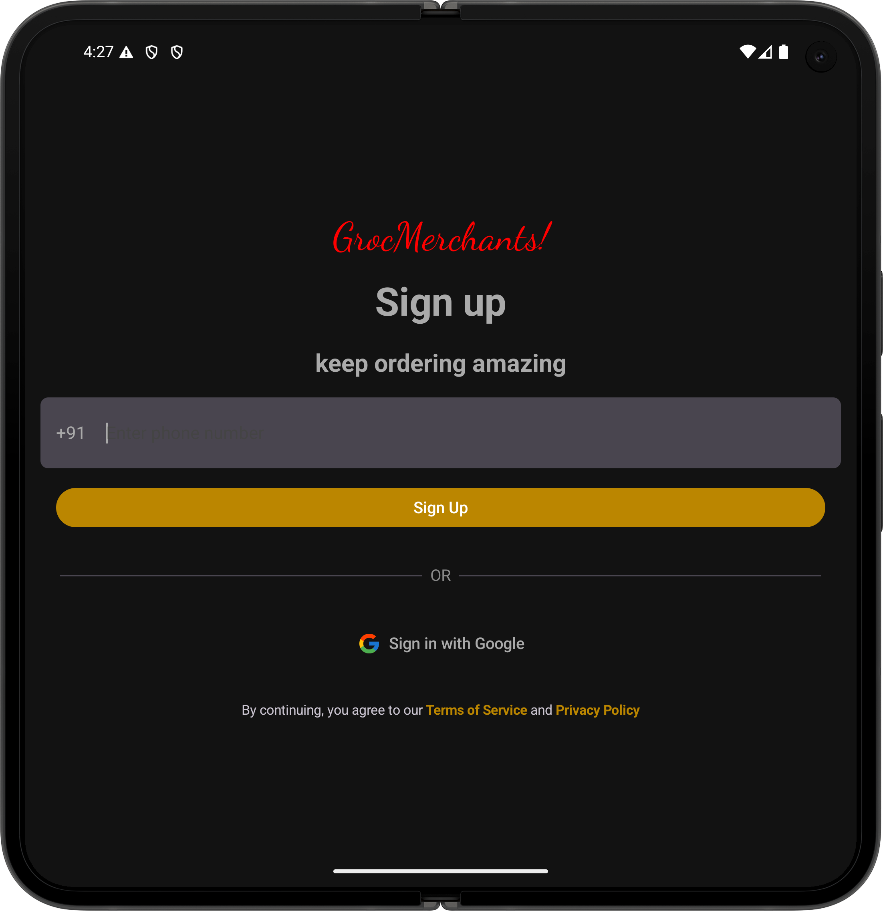
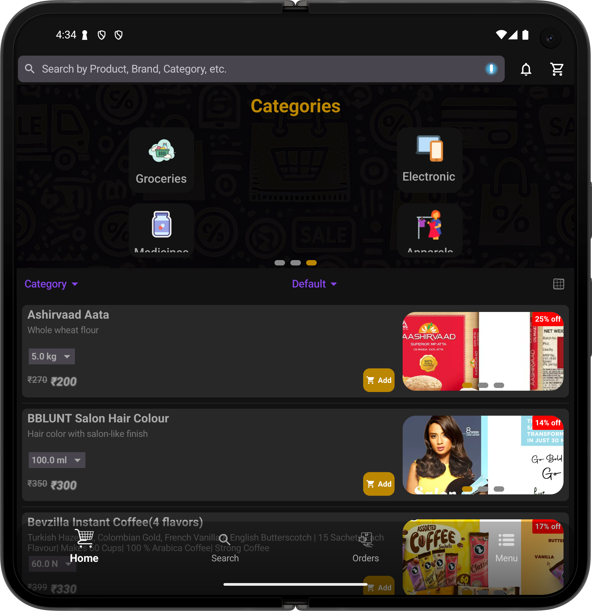
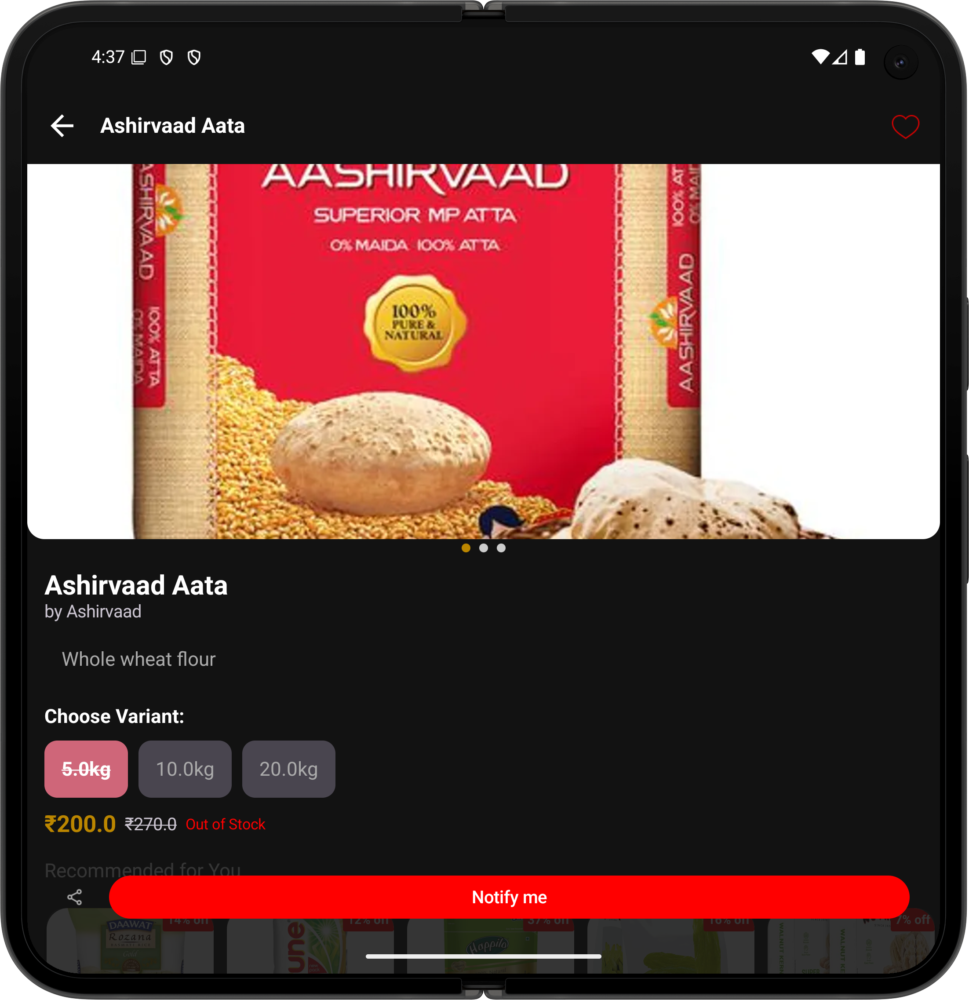
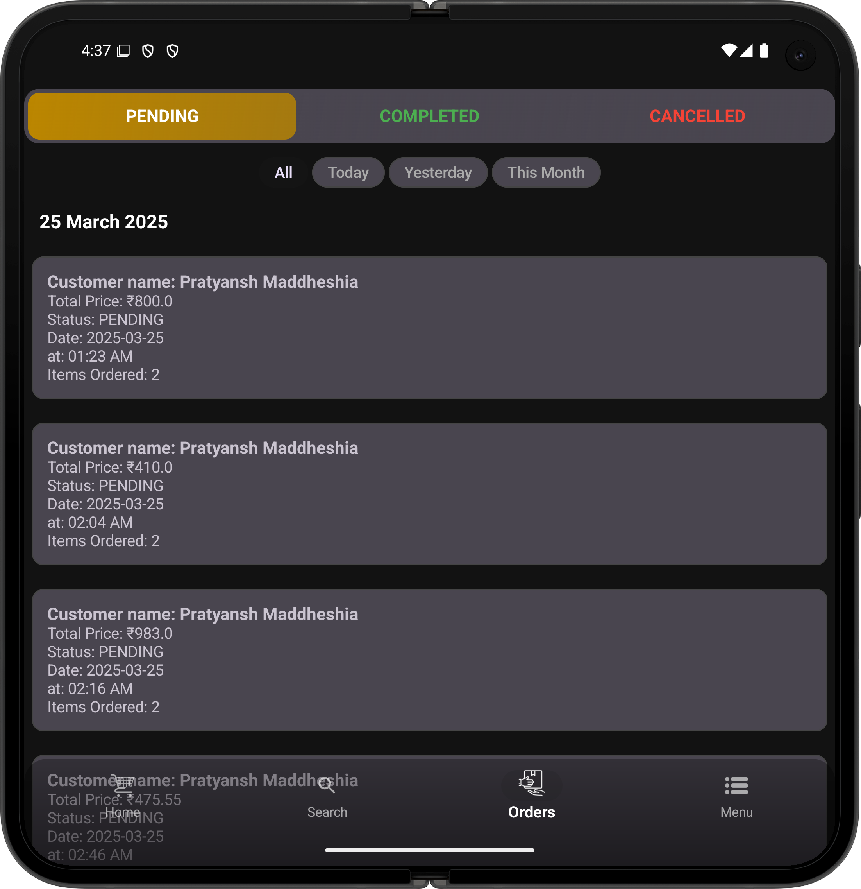
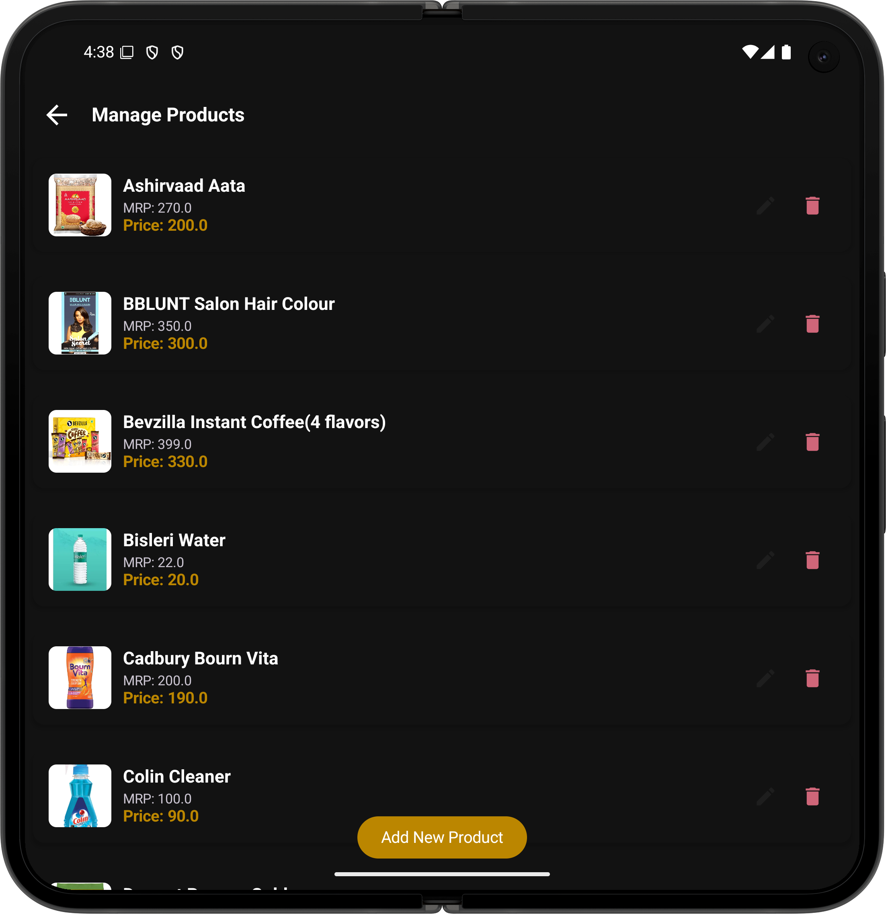
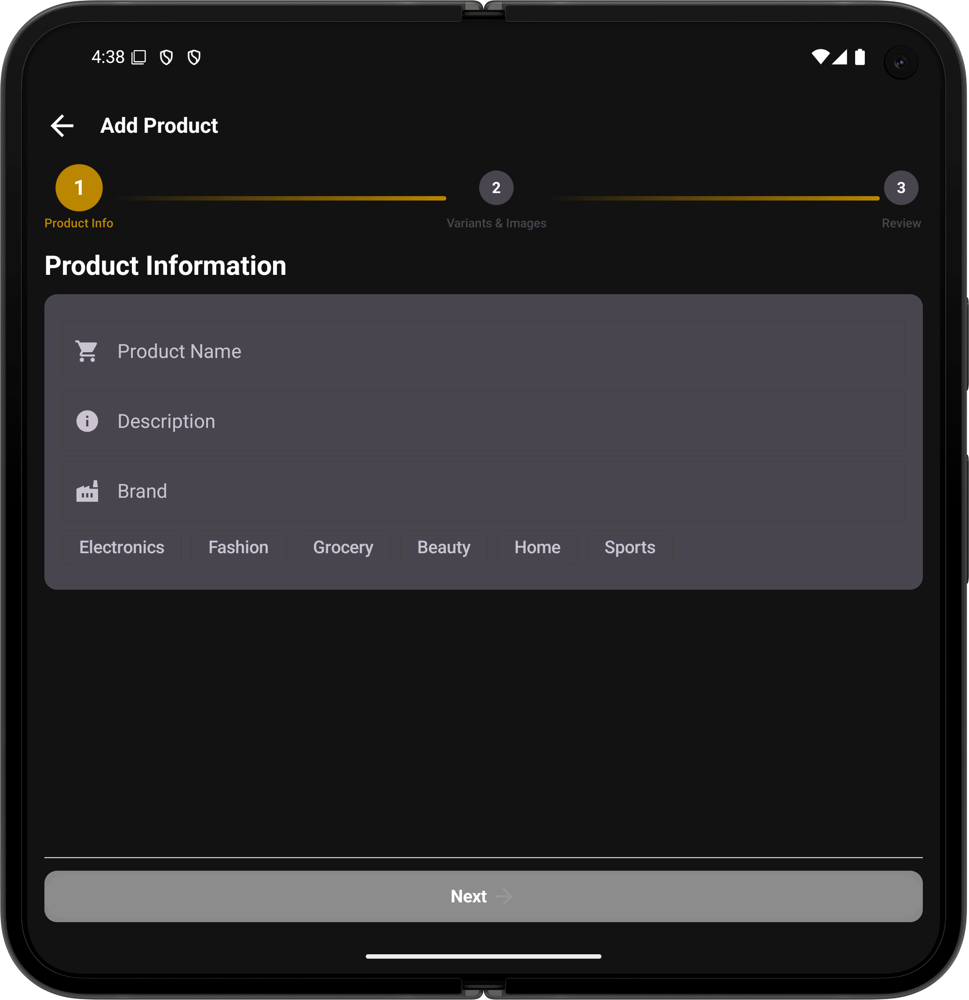
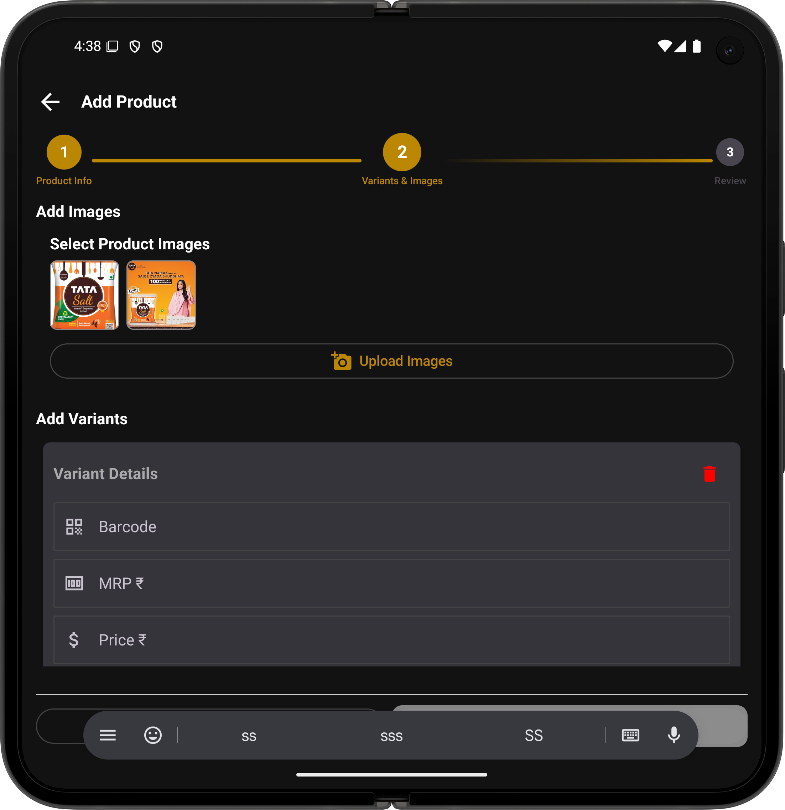
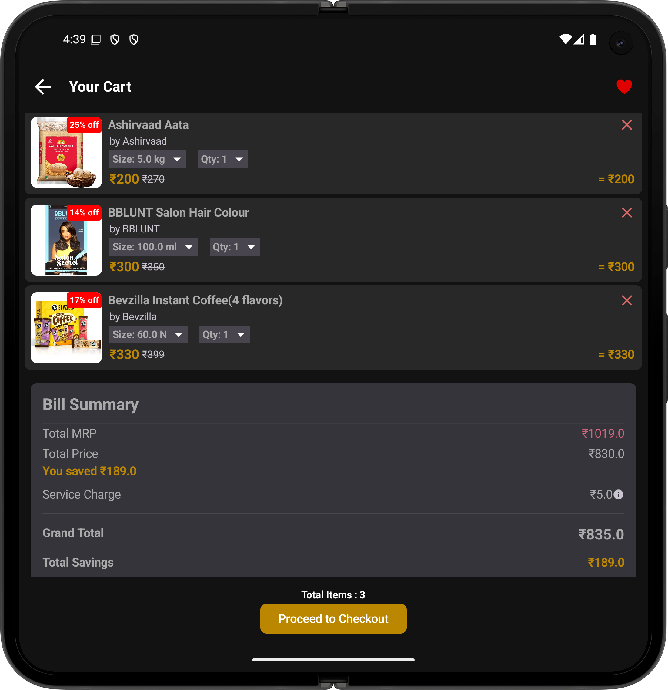
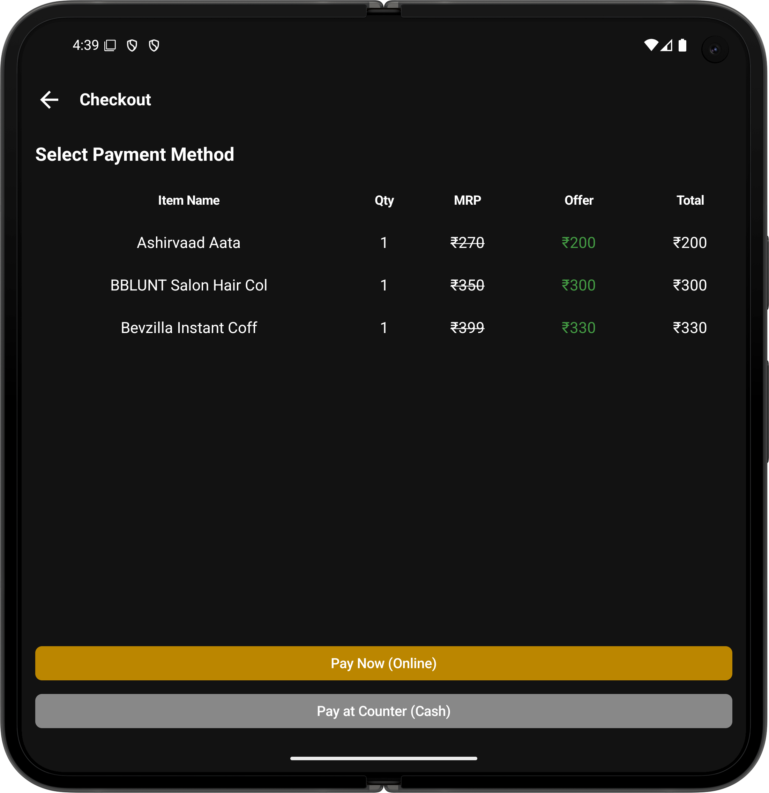

# GrocMerchants

GrocMerchants is a modern Android application built with **Jetpack Compose** for seamless grocery ordering. It provides a user-friendly interface for customers to browse products, add them to their cart, and place orders conveniently.

## Features

- 🛒 **Intuitive Shopping Experience** – Browse a wide range of grocery items.
- 🔍 **Search & Filter** – Find products easily with search and category filters.
- 📦 **Cart & Checkout** – Add items to the cart and proceed with an easy checkout process.
- 📊 **Order Tracking** – View order history and track the status of current orders.
- 🌙 **Dark Mode Support** – Optimized for both light and dark themes.
- 🚀 **Smooth Performance** – Built with Jetpack Compose for a fluid and responsive UI.

## Screenshots

Below are sample UI screenshots from the app:

  
  
  

## Tech Stack

- **Kotlin** – Primary language
- **Jetpack Compose** – UI development
- **Firebase Firestore** – Backend for managing product and order data
- **Firebase Authentication** – Secure user login
- **MVVM Architecture** – Clean and modular code structure

## Installation

### Prerequisites

- Android Studio **Giraffe** or newer
- Minimum **SDK 24+**
- Internet connection for Firebase services

### Steps

1. Clone the repository:
   ```sh
   git clone https://github.com/Pratyansh/My_ShopApp.git
   ```
2. Open the project in **Android Studio**.
3. Sync Gradle and resolve dependencies.
4. Run the app on an emulator or a physical device.

## How to Use

1. **Sign Up / Log In** – Create an account or log in with Firebase Authentication.
2. **Browse Products** – Scroll through categories and search for groceries.
3. **Add to Cart** – Select items and add them to your shopping cart.
4. **Checkout & Payment** – Place an order and complete the payment process.
5. **Track Orders** – View past orders and their status.

## Contribution

Contributions are welcome! Feel free to fork the repo and submit a pull request.

## License

This project is licensed under the **MIT License**.

---

Made with ❤️ by Pratyansh Maddhesiya

